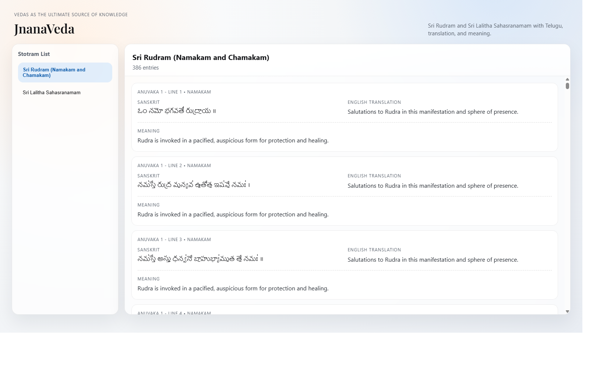

# JnanaVeda

JnanaVeda is a static web app that presents sacred stotra content in a structured dual-column reading layout:
- Left: original Telugu verse text
- Right: English translation and meaning/explanation

## Included Content

1. Sri Rudram (Namakam and Chamakam)
- Telugu source preserved from user-provided text files
- Parsed into sub-verse line entries under anuvaka structure
- Each entry includes contextual English translation and meaning

2. Sri Lalitha Sahasranamam
- Telugu source preserved from user-provided text file
- Parsed into 183 main verse blocks
- Each verse includes English translation and meaning

## UI Summary

- Apple-inspired clean split-panel layout
- Left sidebar for stotram selection
- Right scrollable panel for verse cards
- Verse card format:
  - Telugu verse (left)
  - English translation (right)
  - Meaning (below)

## Illustrations

Latest screenshots of the current UI:

### Desktop View



### Mobile View


## Project Files

- `index.html` - page structure and templates
- `styles.css` - UI styling and responsive behavior
- `app.js` - stotram dataset + rendering logic

## Data Sources (Local)

- `C:\Users\krish\Downloads\Codex_projects\Namakam.txt`
- `C:\Users\krish\Downloads\Codex_projects\Chamakam.txt`
- `C:\Users\krish\Downloads\Codex_projects\Sri Lalitha Sahasranamam.txt`

## Run Locally

Open `index.html` directly in a browser, or run a simple static server.

Example (PowerShell):
```powershell
cd "c:\Users\krish\Downloads\Codex_projects\Stotra nidhi"
python -m http.server 8080
```
Then open `http://localhost:8080`.
